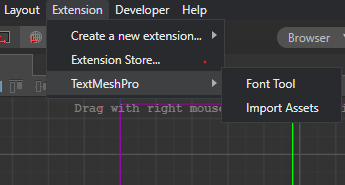
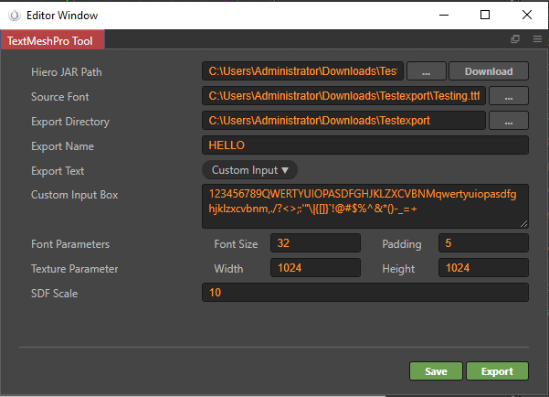
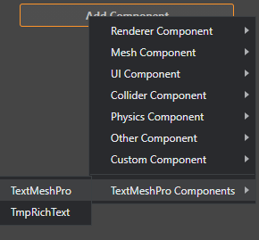
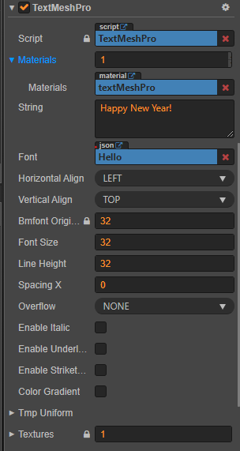

# Table of Contents
- [Preface](#preface)
- [TextMeshPro Features (Cocos Creator Integration)](#textmeshpro-features-cocos-creator-integration)
- [Version Support](#version-support)
- [Installation of Extension/Tool](#installation-of-extensiontool)
- [Using the tool](#using-the-tool)
    - [Font Tool Interface](#font-tool-interface)
    - [Import Assets](#import-assets)
- [Using TextMeshPro Component](#using-textmeshpro-component)
- [Component Parameters](#component-parameters)
- [API Methods](#api-methods)
- [Some Animations](#some-animations)
    - [TypeWriter Effect](#typewriter-effect)
    - [Wave Effect](#wave-effect)
- [Precautions](#precautions)

# TextMeshPro for Cocos

Created By: [LeeYip](https://github.com/LeeYip) | [Github](https://github.com/LeeYip/cocos-text-mesh-pro)

Translated By: [RohanPhuyal](https://github.com/RohanPhuyal)

# Preface

If you're familiar with Unity, you know that TextMeshPro in UGUI is a powerful and versatile solution for text rendering. YipLee has developed a project to integrate TextMeshPro into Cocos Creator, originally available in Chinese. I have translated this tool into English to make it accessible for a wider audience.

This translation is based on the 2.4.9 branch and has been tested on version 2.4.8. It should work seamlessly on Cocos Creator versions 2.4.x.

I hope this makes TextMeshPro easier to use for developers working with Cocos Creator.

# TextMeshPro Features (Cocos Creator Integration)

- Text rendering based on SDF (Signed Distance Field)  
- Supports lossless scaling  
- BMFont support with up to 8 textures  
- Efficient export parameters  
    - If the project uses a limited number of languages, all text can be exported into a single font file  
- Texture unit support
    - WebGL typically supports at least 8 texture units  
    - OpenGL typically supports at least 16 texture units  
- Visual Effects  
    - Color gradients  
    - Italics  
    - Underline and strikethrough  
    - Supports effects such as:  
        - Outline  
        - Hollow  
        - Shadow  
        - Glow  
    - These effects apply to underlines and strikethroughs as well  
- Vertex Data Interface  
  - Enables custom vertex animations  
- New Layout Mode: ELLIPSIS  
  - When text exceeds the node size, it automatically ends with "..."  
- Rich Text Support  

# Version Support
The following versions and systems have been tested, and those that are not listed only indicate that they have not been tested yet.

| Cocos Creator | v2.4.8 |
|---------------|--------|
| Android       | ✓      |
| Web           | ✓      |

- This one is taken from v2.4.9 branch. This branch should be available for the 2.4.x series version, but there is a bug in the calculation of the hash value of the engine source code material in the 2.4.5 and below versions, which will lead to the failure to combine batches in some cases, please test by yourself

# Installation of Extension/Tool
1. Clone or Download the repo
2. Locate and open packages folder (`Downloads\cocos-text-mesh-pro\packages`)
3. Copy the directory textmeshpro-tool (`textmeshpro-tool`)
4. Locate and goto your project directory where you want to use the tool (`D:\CocosProjects\ProjectName`)
5. You are ready to go (You can now find tool in Extension of your project)

# Using the tool

**Extension:**  


Extension have two option

1. **Font Tool**

    # Font Tool Interface

    The Font Tool interface is shown in the image below.

    **Font Tool** is an SDF font generator 

    

    **NOTE:** Make sure the path don't have space

    (`C:\my path `) wrong(×)

    (`C:\my-path`) right (✓)

    - **Hiero Path:**  
    The font export dependency tool. Click the download button to enter the download address. You need to make sure that the Java environment is installed to run this tool.

    - **Source Font:**  
    The TTF font file to be exported.

    - **Export Directory:**  
    SDF font export directory.

    - **Export Name:**  
    The name of the exported SDF font file.

    - **Export Text:**  
    You can choose to export the text in the input box or the text in the txt file.

    - **Font Parameters:** 
        - **Font Size:** The font export size.  
        - **Padding:** The font spacing.  
    These two parameters, when larger, will improve the rendering effect, but too large may lead to too many textures being exported. Note that the texture limit should not be exceeded.

    - **Texture Parameter:**  
    The size of the exported texture.

    - **SDF Scale:**  
    The larger this parameter, the better the final rendering. However, too large will cause the font to export too slowly. The principle is to enlarge all fonts with this value before exporting the font, then generate the SDF texture, and finally reduce the font to the exported font size for export.

    - **Save:**  
    Saves the configuration of the plug-in.

    - **Export:**  
    Exports fonts and generates the JSON and PNG files required for runtime. During this process, the Hiero tool will automatically open with the command line. The export may be very slow depending on the set parameters, so please be patient and wait for Hiero to close by itself.

2. **Import Assets**

    It imports necessary assets to use TextMeshPro or TmpRichText Component on your nodes.
    After import You can see new folder in your assets named `textMeshPro` with all necessary assets.

# Using TextMeshPro Component
After exporting png and json with **font tool** and importing assets, we are now ready to use TextMeshPro on our project. Follow below **steps** to use the tool:

1. Create an **Empty Node**
2. Select the **node** in Node Tree and click **Add Components** in properties
3. You can see new option called **TextMeshPro Components**, hover and select **TextMEshPro** or **TmpRichText**
    
4. You can now see the component with various option you can play with

    

# Component Parameters

- **Font**: Use the font JSON file exported by the Font Tool.
- **Overflow**: In addition to the Cocos Creator Label component's layout method, a new layout mode ELLIPSIS is provided. It automatically calculates the text size, and if it exceeds the node size, it ends with "...". (The exported text must contain the character ".")
- **EnableItalic**: Italic.
- **EnableUnderline**: Underline, adjustable height (the exported text must contain the character "_").
- **EnableStrikethrough**: Strikethrough, adjustable height (the exported text must contain the character "_").
- **ColorGradient**: Color gradient switch, provides color settings for four vertices, which will be mixed with the vertex color to form the final vertex color.
- **TmpUniform**: Controls shader parameters, different parameters will affect TextMeshPro's batching.
- **FaceColor**: The color of the text body.
- **FaceDilate**: The thickness of the text body, range 0-1, 0.5 is the standard value.
- **FaceSoftness**: The softness of the text body, the smaller the value, the harder the font display, the larger the value, the more blurred the font display.
- **EnableOutline**: Outline switch, combined with FaceColor transparency can achieve text hollow effect.
- **OutlineColor**: Outline color.
- **OutlineThickness**: Outline thickness.
- **EnableUnderlay**: Shadow switch.
- **UnderlayColor**: Shadow color.
- **UnderlayOffset**: Shadow offset, if the x direction is offset by one pixel, the value to be filled in is 1/texture width, the same applies to the y direction.
- **UnderlayDilate**: Shadow thickness.
- **UnderlaySoftness**: Shadow softness.
- **EnableGlow**: Glow switch, can be understood as an additional outline effect superimposed on other text effects, so the darker the color below, the more obvious the effect.
- **GlowColor**: Glow color.
- **GlowOffset**: Glow offset, range 0-1, 0.5 is the standard value.
- **GlowInner**: The thickness of the glow inward.
- **GlowOuter**: The thickness of the glow outward.
- **GlowPower**: Glow intensity, range 0-1, 1 is the strongest.
- **Textures**: Textures that the font depends on.

# API Methods

- **forceUpdateRenderData(): void**: Immediately updates the rendering data.
- **setFont(font: cc.JsonAsset, textures: cc.Texture2D[]): void**: Dynamically sets the font.
- **isVisible(index: number): boolean**: Determines whether the character at the specified index is visible.
- **setVisible(index: number, visible: boolean): void**: Sets the visibility of the character at the specified index.
- **getColorExtraVertices(index: number): [cc.Color, cc.Color, cc.Color, cc.Color] | null**: Gets the color vertex data for the character at the specified index, in the order [bottom-left, bottom-right, top-left, top-right].
- **setColorExtraVertices(index: number, data: [cc.Color, cc.Color, cc.Color, cc.Color]): void**: Sets the color vertex data for the character at the specified index, which will be mixed with the node color to form the final vertex color, in the order [bottom-left, bottom-right, top-left, top-right].
- **getPosVertices(index: number): [cc.Vec2, cc.Vec2, cc.Vec2, cc.Vec2] | null**: Gets the position vertex data for the character at the specified index, in the order [bottom-left, bottom-right, top-left, top-right].
- **setPosVertices(index: number, data: [cc.Vec2, cc.Vec2, cc.Vec2, cc.Vec2]): void**: Sets the position vertex data for the character at the specified index, in the order [bottom-left, bottom-right, top-left, top-right].

# Some Animations

**TypeWriter Effect**


```typescript
public _fScale: number = 1;
    public _xOffset: number = 0;
    private async anim1(): Promise<void> {
        await this.waitCmpt(this, 0.5);
        this.textMesh.string = "Happy New Year";
        this.textMesh.forceUpdateRenderData();
        for (let i = 0; i < this.textMesh.string.length; i++) {
            this.textMesh.setVisible(i, false);
        }
        for (let i = 0; i < this.textMesh.string.length; i++) {
            this.textMesh.setVisible(i, true);
            if (!this.textMesh.isVisible(i)) {
                continue;
            }
            let result: any = this.textMesh.getPosVertices(i);
            let center = new cc.Vec3();
            center.x = (result[0].x + result[1].x + result[2].x + result[3].x) / 4;
            center.y = (result[0].y + result[1].y + result[2].y + result[3].y) / 4;
            this._xOffset = -50;
            let updateCall = () => {
                let copy: cc.Vec3[] = [];
                copy.push(result[0].clone());
                copy.push(result[1].clone());
                copy.push(result[2].clone());
                copy.push(result[3].clone());
                for (let j = 0; j < 4; j++) {
                    let delta: cc.Vec3 = new cc.Vec3();
                    cc.Vec3.subtract(delta, copy[j], center);
                    delta.multiplyScalar(this._fScale).add(new cc.Vec3(this._xOffset, 0));
                    cc.Vec3.add(copy[j], center, delta);
                }
                this.textMesh.setPosVertices(i, copy as any);
            }
            cc.tween<TextMesh>(this)
                .to(0.2, { _fScale: 2, _xOffset: -15 }, { onUpdate: updateCall })
                .to(0.2, { _fScale: 1, _xOffset: 0 }, { onUpdate: updateCall })
                .start();
            await this.waitCmpt(this, 0.4);
        }
    }
```

**waitCmpt script**: 
```typescript
 // Utility function to wait
    private waitCmpt(target, delay: number): Promise<void> {
        return new Promise(resolve => {
            cc.tween(target)
                .delay(delay)
                .call(() => resolve())
                .start();
        });
    }
```

**Wave Effect**


```typescript
private waveAnimation() {
        this.schedule(() => {
            this.time += 0.1;
            for (let i = 0; i < this.textMesh.string.length; i++) {
                let result = this.textMesh.getPosVertices(i);
                let amplitude = 2;  // Wave height
                let frequency = 0.3; // Wave speed
                let offsetY = Math.sin(this.time + i * frequency) * amplitude;
                let updatedVertices:any = result.map(v => {
                    return new cc.Vec3(v.x, v.y + offsetY, 0);
                });
                this.textMesh.setPosVertices(i, updatedVertices);
            }
        }, 0.01); // Refresh rate for smoother animation
    }
```

# Precautions
- Don't type font textures into the atlas
- Vertex data that controls underscores and strikethroughs is not available
- Personal time and energy are limited, and it is inevitable that there will be omissions, so please fully  test yourself before use